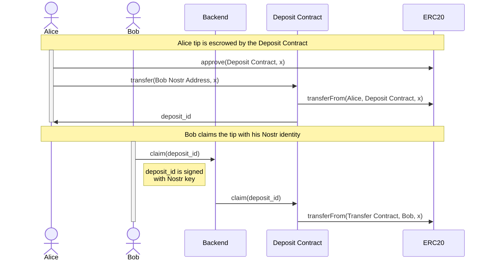
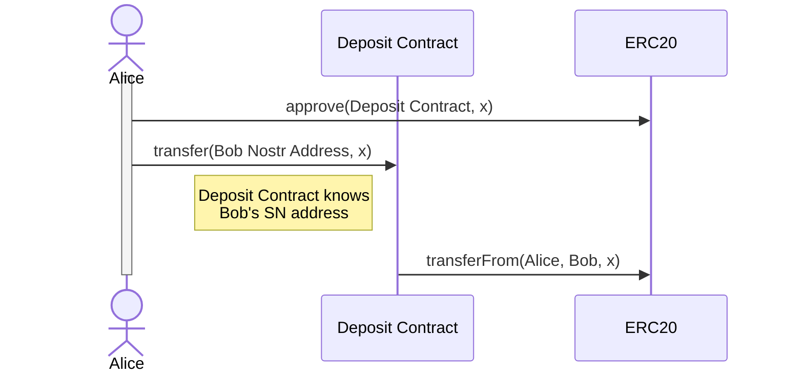
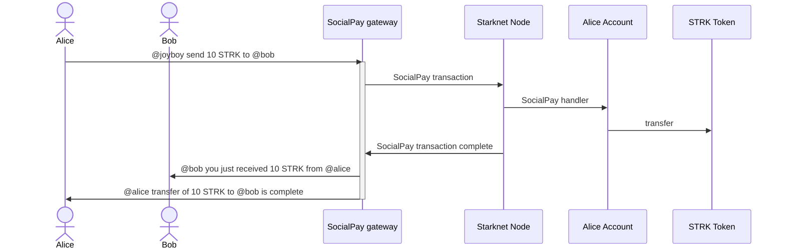

# Joyboy Contracts

## Overview

Decentralized social built with Nostr and powered by Starknet account abstraction.

## Architecture

### Tips
There are two alternatives: WalletConnect, one which expects Nostr users to set up oridinary Starknet wallet like Argent or Braavos, and so called SocialPay which uses custom Account Abstraction contract based on bip340 signature scheme (Nostr native).

#### Wallet Connect
##### Tip to a recipient that never accepted the tip and don't have an account on SN


##### Tip to a recipient that earlier accepted the tip


#### SocialPay

##### Alice sends tokens to Bob



## Building and Testing

The onchain components of the project are implemented as a suite of Starknet smart contracts.

### Build

To build the project, run:

```bash
scarb build
```

### Test

To test the project, run:

```bash
snforge test
```

</details>

## Resources

- [Starknet](https://starknet.io/)
- [Nostr](https://www.nostr.com/)
- [Nostr Implementation Possibilities](https://github.com/nostr-protocol/nips)
- [JoinStr: Decentralized CoinJoin Implementation Using Nostr](https://www.nobsbitcoin.com/joinstr-decentralized-coinjoin-implementation-using-nostr/)
- [Smart Vaults - Bitcoin multi-custody signature orchestration - website](https://www.smartvaults.io/)
- [Smart Vaults - Bitcoin multi-custody signature orchestration - repo](https://github.com/smartvaults/smartvaults)
